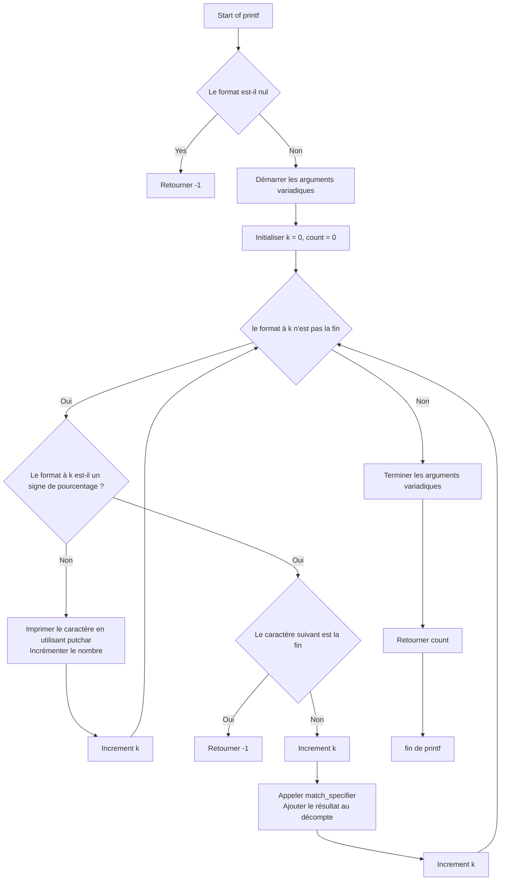

# Printf Function Project
A simplified reimplementation of the function `printf`. This project demonstrates key C concepts such as variadic functions, function pointers, and structure use.
---
## Table of Contents
- [Features](#features)
- [Supported Format Specifiers](#supported-format-specifiers)
- [Project Structure](#project-structure)
- [Flowchart](#flowchart)
- [How to Compile](#how-to-compile)
- [How to execute](#how-to-execute)
- [Manual Page](#Manual-page)
- [Usage Examples](#usage-examples)
- [Limitations](#limitations)
- [Authors](#authors)
---
## Features
- Handles of format specifiers (`%c`, `%s`, `%d`, `%i`, and `%%`)
- Clean modular structure using function pointers and `struct` dispatch
- Handling of null strings
- Mimics the behavior of standard `printf` in a simplified way
---
## Supported Format Specifiers
| Specifier | Description                   |
|-----------|-------------------------------|
| `%c`      | Character                     |
| `%s`      | String                        |
| `%%`      | Literal percent sign          |
| `%d`      | Signed decimal integer        |
| `%i`      | Signed decimal integer        |
---
## Project Structure
| File               | Description |
|--------------------|-------------|
| `main.h`           | Header file with declarations and `type_specifier` struct |
| `_printf.c`        | Core implementation of `_printf` |
| `specifiers.c`     | Returns array of supported specifiers |
| `_putchar.c`       | Wrapper for `write` to output characters |
---
## Flowchart


---
## How to Compile
You can compile all source files using `gcc`:
```bash
gcc -Wall -Werror -Wextra -pedantic -std=gnu89 -Wno-format *.c
```
---
## How to execute
```bash
./a.aout
```
---
## Manual page
To open the manual, use the following command :
```bash
man ./man_3_printf
```
---
## Usage Examples
```bash
_printf("Let's try to printf a simple sentence.\n");
// Output: Let's try to printf a simple sentence.
_printf("Length:[%d, %i]\n", 42, 42);
// Output: Length:[42, 42]
_printf("Character:[%c]\n", 'H');
// Output: Character:[H]
_printf("String:[%s]\n", "I am a string !");
// Output: String:[I am a string !]
_printf("Percent:[%%]\n");
// Output: Percent:[%]
```
---
## Limitations
Does not support width, precision, flags, or length modifiers
Undefined behavior for unsupported format specifiers (prints %x if %x is unknown)
No float or hex support (%f, %x, %X, %u, etc.)
---

## Authors
Joevin & Sanoussy


